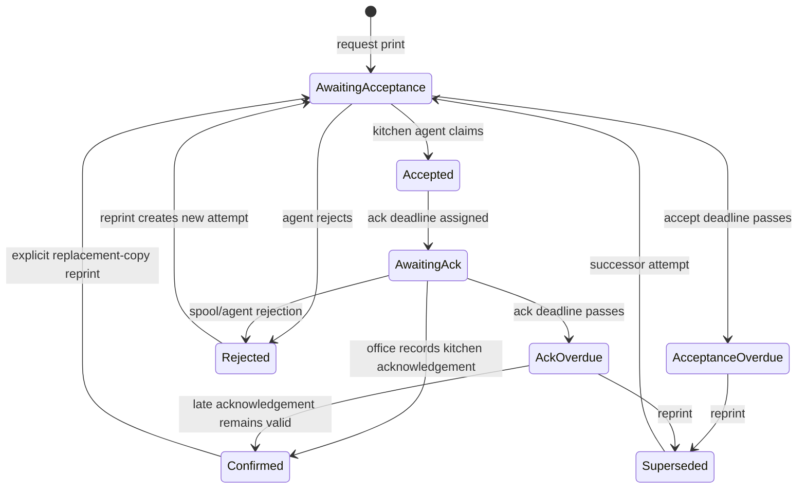

# PHASE_3_PRINT_ACK_ATTENTION_PACK_V1

Status: **prepared design/implementation pack; no production code changed**

Evidence baseline: repository `HEAD 1ccf382`, 2026-07-14, Europe/Berlin

Scope owner: Core operational print handoff and Office attention

Implementation status: **not started**

## 1. Purpose

Phase 3 adds a reliable, fail-visible Office signal when a kitchen print has
not been confirmed. It must distinguish a durable print request from technical
acceptance by a kitchen-side service and from the existing domain confirmation
that gates `wirksam`.

This pack does not change production code, deploy a service, provision Proxmox,
touch `core.db`, or change live printer configuration. It fixes the target
contract and an implementation order for later, separately approved slices.

### 1.1 Naming reconciliation

`docs/proposals/PROXMOX_OFFICE_SERVER_CORE_API_PACK_V1.md` already calls
Proxmox VM provisioning “Phase 3”. The owner has now explicitly assigned the
Phase 3 name to print-ACK attention. This document does not silently rewrite
the frozen Proxmox pack. Future work must use unambiguous names:

- **Print-ACK Phase 3** — this pack;
- **Proxmox provisioning** — the still-unexecuted infrastructure milestone
  previously labelled Phase 3 in the Proxmox pack.

The two work streams have a dependency: an Office Panel running on the Lenovo
cannot render an in-app warning when the whole Lenovo is down. A distinct
“Lenovo/Core unavailable” warning requires the remote Office Panel (or another
observer outside the Lenovo) to be running.

## 2. Verified current state

### 2.1 Stored facts

The complete persisted print/effective model is currently:

| Record | Field | Meaning |
|---|---|---|
| `OrderVersion` | `kitchen_print_confirmed_at: datetime | None` | irreversible domain fact; set manually through `ConfirmKitchenPrint` |
| `Order` | `candidate_order_version_id: str | None` | office-side progression hint, not operational truth |
| `Order` | `effective_order_version_id: str | None` | the one operationally effective version |
| `Order` | `cancelled_at: datetime | None` | irreversible Storno fact |

There is no print-job ID, request timestamp, technical acceptance timestamp,
acknowledgement deadline, attempt number, failure reason, service heartbeat, or
reprint history.

The SQLite schema mirrors those fields. `kitchen_print_confirmed_at` is the
last column of `order_versions`; there is no print-job table.

### 2.2 Existing commands and transitions

`OperationalCoreService.confirm_kitchen_print(order_id,
order_version_id)`:

- validates that the active Order exists and owns the OrderVersion;
- is idempotent;
- sets `kitchen_print_confirmed_at` to UTC now;
- emits `KitchenPrintConfirmed` once;
- is not revocable;
- does not make the version effective.

`OperationalCoreService.make_order_version_effective(order_id,
order_version_id)`:

- validates active-order ownership;
- refuses a version whose `kitchen_print_confirmed_at` is `None`;
- explicitly writes `Order.effective_order_version_id`;
- may target any owned, print-confirmed version, not only the candidate or
  latest version;
- does not change candidate selection or history.

A new version therefore becomes `wirksam` only through the explicit chain:

1. Office `POST /order/{order_id}/print-confirm`;
2. direct mode calls `OperationalCoreService.confirm_kitchen_print`, while
   remote mode sends `POST /office/v1/orders/{id}/print-confirm`;
3. Office separately posts `/order/{order_id}/effective`;
4. direct mode calls `make_order_version_effective`, while remote mode sends
   `POST /office/v1/orders/{id}/effective` with the current effective-pointer
   precondition;
5. Core refuses step 4 unless step 2 has produced the stored timestamp.

There is no implicit effective switch on version creation, print-sheet open,
print confirmation, or `READY_TO_SEND` request.

### 2.3 Current print surface

`Küchenzettel` is an HTML page rendered by the Office Panel. Its “Drucken”
button executes `window.print()` in the Office browser. Opening the page and
printing it write nothing to Core.

The repository has no physical printer adapter, spooler integration, kitchen
print service, job queue, agent heartbeat, or machine acknowledgement. The
accepted operational-core pack explicitly deferred physical printer
integration.

The operator guide therefore relies on a manual sequence: open sheet, print,
then click `Druck bestätigt` only after the print was actually handled.

### 2.4 Existing statuses and blocker logic

The current status vocabulary is deliberately small:

- print: `kitchen_print_confirmed_at is None` or a UTC timestamp;
- selection: candidate, effective (`wirksam`), or neither;
- cancellation: active or `STORNIERT`;
- `READY_TO_SEND`: derived, never stored.

Current `READY_TO_SEND` reasons are:

- `ready_to_send_order_not_found`;
- `order_cancelled`;
- `no_effective_version`;
- `effective_version_not_resolvable`;
- `kitchen_print_not_confirmed`.

The effective-switch command is the hard gate. In a valid service-created
state, an unconfirmed version cannot become effective, so a fresh order is
normally reported as `no_effective_version`; the later
`kitchen_print_not_confirmed` reason mainly protects inconsistent/legacy facts
where an effective pointer already exists.

The B7 progression reasons and the operational `READY_TO_SEND` reasons are
separate vocabularies and must remain separate. Print-delivery attention will
be a third, narrowly named read vocabulary; it must not be merged into either.

### 2.5 Current Office Panel display

The Office Panel currently shows:

- a `Druckbestätigung fehlt` attention count;
- `Aufträge noch nicht wirksam`;
- `Versandfreigabe blockiert`;
- an order queue with one next action;
- per-version print-confirm timestamp, `wirksam`/`Kandidat` markers,
  `Küchenzettel`, `Druck bestätigen`, and `Wirksam machen` controls.

The dashboard’s current `druck_fehlt` calculation counts an active Order only
when **none of its versions has ever been print-confirmed**. This is not the
same as “the current candidate/latest target version is unconfirmed”. If v1 is
confirmed/effective and v2 is newly created but unconfirmed:

- `druck_fehlt` can be zero;
- `nicht_wirksam` can be zero because v1 remains effective;
- `READY_TO_SEND` can remain ready because it evaluates v1;
- the dashboard next-step queue, which is sourced from `READY_TO_SEND`-blocked
  orders, can omit the pending v2 entirely.

The detail page also renders `Wirksam machen` for an unconfirmed non-effective
version. Core correctly rejects the click, but the detail UX offers an action
that cannot succeed. The dashboard’s `_next_step_action` already avoids this
and correctly orders print confirmation before `wirksam`.

### 2.6 Existing timeouts

There is no print-acceptance or print-confirmation business timeout.

The only relevant current technical timeouts are:

| Timeout | Current value | Purpose |
|---|---:|---|
| Remote Core read | 3 s | Office Panel HTTP read to Core Office API |
| Remote Core command | 5 s | Office Panel command to Core Office API |
| Core SQLite busy timeout | 2 s | returns `503 core_busy` before the 5 s client timeout |

These transport timeouts say nothing about whether paper was printed or
confirmed and must not be reused as print workflow deadlines.

### 2.7 What the requested failure cases mean today

| Case | Distinguished today? | Current observable result |
|---|---|---|
| Print job not accepted | **No** | no print-job concept exists; version remains unconfirmed |
| Kitchen service unavailable | **No** | no kitchen print service or heartbeat exists |
| Lenovo unavailable | **Partly** | remote mode maps API/network failure to generic `503 Core nicht erreichbar`; it cannot prove whether the Lenovo, API process, Tailscale, or network failed. In current co-located production, the panel itself also disappears |
| Confirmation not received in time | **No** | no deadline or clock-based state exists |
| Reprint | **Only as an untracked browser action** | the same HTML may be opened/printed repeatedly; no attempt number or history is stored; confirmation stays idempotent |

## 3. Gaps to close

1. There is no durable fact that Office requested a print.
2. There is no technical acceptance distinct from human/domain confirmation.
3. There is no clock-owned deadline, so “late” cannot be derived honestly.
4. There is no kitchen agent health signal.
5. There is no append-only attempt history; reprint is invisible.
6. Current attention can miss a new unconfirmed target version when an older
   version remains effective and ready.
7. The order detail can offer `Wirksam machen` before confirmation even though
   Core will reject it.
8. The current `KitchenPrintConfirmed` event is ephemeral unless a caller
   supplies an event sink; it is not a durable attention source.
9. A co-located panel cannot signal total Lenovo failure from inside the
   failed machine.
10. The physical printer, printer protocol, acceptance semantics, and
    production device configuration are not evidenced in this repository.

## 4. Target terminology

The following terms are fixed and must not be conflated:

- **Print request** — a durable Core record asking the kitchen print agent to
  handle one exact immutable OrderVersion.
- **Technical acceptance** — the kitchen print agent has claimed the durable
  request. It does **not** prove paper output or kitchen review.
- **Technical rejection** — the live agent reports that it cannot process the
  request, using an allowlisted non-PII reason.
- **Print acknowledgement / confirmation** — the existing strong domain fact:
  the intended kitchen print was actually handled and reviewed. This is what
  sets `OrderVersion.kitchen_print_confirmed_at` and gates `wirksam`.
- **Reprint** — a new append-only print attempt for the same OrderVersion. It
  never overwrites or deletes an older attempt.
- **Agent unavailable** — the Core API is reachable but has not received a
  timely heartbeat from the kitchen print agent.
- **Lenovo/Core unavailable** — the external Office observer cannot reach the
  Core Office API. Job-specific state is then unknown, never all-clear.

## 5. Target data model

### 5.1 New append-only `KitchenPrintJob`

Add a dedicated Core record rather than more status fields on `OrderVersion`:

| Field | Type | Rule |
|---|---|---|
| `print_job_id` | UUID4 | primary key; minted before form submission so direct and remote retries are idempotent |
| `order_id` | UUID4 | must exist and own `order_version_id` |
| `order_version_id` | UUID4 | immutable target version |
| `attempt_number` | positive int | unique and monotonically increasing per OrderVersion |
| `requested_at` | UTC datetime | immutable |
| `accept_deadline_at` | UTC datetime | immutable; fixed when requested |
| `accepted_at` | UTC datetime or null | agent technical acceptance |
| `ack_deadline_at` | UTC datetime or null | fixed when accepted |
| `rejected_at` | UTC datetime or null | explicit technical rejection |
| `rejection_code` | allowlisted string or null | present exactly when rejected |
| `acknowledged_at` | UTC datetime or null | attempt-level acknowledgement |
| `superseded_at` | UTC datetime or null | older live attempt replaced by reprint |
| `supersedes_print_job_id` | UUID4 or null | previous attempt named by a reprint |

Do not add a stored `status` column. The state is derived from the facts and
Core time so it cannot drift.

The job stores opaque IDs and timestamps only. Customer names, contact data,
addresses, rendered HTML/PDF, bearer tokens, and printer command output must
not be persisted in this table or command ledger.

### 5.2 Why this is separate from `OrderVersion`

- A version has at most one irreversible domain confirmation timestamp but may
  have multiple print attempts.
- Reprint history cannot be represented by one timestamp.
- Technical delivery failure must not weaken or reinterpret the existing
  operational gate.
- `READY_TO_SEND` must stay derived from Order/OrderVersion facts, not from a
  delivery queue.

### 5.3 Derived state precedence

For one job, Core derives exactly one state in this order:

1. `cancelled` — owner Order is cancelled and the job was not acknowledged;
2. `confirmed` — `acknowledged_at` is set;
3. `rejected` — `rejected_at` is set;
4. `superseded` — `superseded_at` is set;
5. `ack_overdue` — accepted, unacknowledged, and Core time is at/after
   `ack_deadline_at`;
6. `awaiting_ack` — accepted and still before the ACK deadline;
7. `acceptance_overdue` — not accepted and Core time is at/after
   `accept_deadline_at`;
8. `awaiting_acceptance` — requested and still before the acceptance deadline.

For a target version with no job and no existing confirmation, the Office read
model derives `not_requested`. This is not stored.

Existing versions with `kitchen_print_confirmed_at` but no historical job are
`legacy_confirmed`: they remain valid and produce no attention. Migration must
not fabricate historical print jobs.

### 5.4 Proposed timeout policy

These are proposed freeze defaults and must be owner-accepted before the agent
or Office UX slice is implemented:

| Policy | Proposed value | Semantics |
|---|---:|---|
| Agent heartbeat interval | 10 s | agent reports liveness to Core API |
| Agent stale threshold | 30 s | three missed heartbeats => unavailable |
| Job acceptance deadline | 30 s from request | no technical acceptance => `acceptance_overdue` |
| Kitchen ACK deadline | 5 min from acceptance | no domain confirmation => `ack_overdue` |
| Office print-attention refresh | 15 s | bounds visible dashboard delay while open |

Deadlines are persisted on each job. A later policy change affects only new
jobs and never retroactively moves an existing deadline. Tests use an injected
clock; no test sleeps until a business deadline passes.

## 6. Target state machine

Rules behind the diagram:

- Time-based states are derived; no sweeper is required to make an overdue
  state truthful.
- Late acknowledgement after `ack_overdue` is allowed and clears the alert.
- Agent acceptance after `acceptance_overdue` is refused; Office must create a
  new explicit reprint attempt. This prevents a stale job from printing after
  the operator has moved on.
- Reprint marks one still-live prior attempt `superseded_at` and creates a new
  row atomically. Rejected/confirmed history is not rewritten.
- A reprint after the OrderVersion was already confirmed records its own
  attempt-level acknowledgement but never clears or re-stamps the original
  `kitchen_print_confirmed_at`.
- Cancellation blocks new requests, claims, confirmations, and reprints. A
  pre-cancellation attempt remains audit history and is not silently deleted.

## 7. Core invariants

1. `kitchen_print_confirmed_at` remains the only OrderVersion fact that can
   satisfy the existing effective-switch gate.
2. Technical acceptance never sets `kitchen_print_confirmed_at` and never makes
   a version effective.
3. A first domain confirmation requires an accepted, non-rejected,
   non-superseded job for that exact active OrderVersion.
4. Acknowledging a job and setting `kitchen_print_confirmed_at` happen in one
   Core transaction with one timestamp; both commit or both roll back.
5. Confirmation stays idempotent and non-revocable. Reprint does not reset it.
6. `MakeOrderVersionEffective` remains an explicit, separate command. No print
   transition auto-selects candidate/effective state.
7. `READY_TO_SEND` semantics and reason vocabulary remain unchanged.
8. Print-attention reasons are a separate read vocabulary and never become a
   stored Order status or a READY_TO_SEND reason.
9. Every attempt targets one immutable OrderVersion; the target snapshot is
   never copied into a second business store.
10. Attempt numbers are unique per OrderVersion; at most one nonterminal,
    non-superseded job is live per OrderVersion.
11. Request, acceptance, rejection, acknowledgement, and reprint are
    idempotent. Same ID + same fingerprint returns the original result; same ID
    + different fingerprint is a conflict.
12. All optimistic checks and job/business writes are inside the same
    `BEGIN IMMEDIATE` transaction as the command-ledger entry.
13. Core UTC time owns state derivation. Browser and kitchen-agent clocks never
    decide whether a job is overdue.
14. Core/API failure is rendered as unknown/attention, never as zero jobs or an
    empty all-clear queue.
15. The kitchen kiosk remains read-only. Phase 3 does not add a kiosk POST or
    turn the kiosk into an acknowledgement surface.
16. The kitchen print agent never opens `core.db`; ADR-011’s Core boundary is
    preserved.
17. No PII, rendered sheet body, token, or raw printer output is written to
    logs or the command ledger.

## 8. Kitchen print agent boundary

Phase 3 requires a new narrow `kitchen_print_agent` because no such service
exists today.

Responsibilities:

- heartbeat to Core API;
- claim one durable job idempotently;
- obtain the immutable print data for that job;
- hand it to a printer adapter;
- report a small allowlisted technical rejection when it cannot proceed;
- never confirm the domain fact automatically.

Non-responsibilities:

- no direct SQLite access;
- no Order/OrderVersion mutation outside named API commands;
- no candidate/effective selection;
- no READY_TO_SEND decision;
- no customer communication;
- no business retry loop that hides a failure from Office;
- no write added to the existing kitchen kiosk.

Recommended initial rejection codes:

- `render_failed`;
- `spool_rejected`;
- `printer_unavailable`;
- `invalid_printer_configuration`;
- `order_cancelled`.

Unknown errors map to `internal` at the transport boundary and are logged only
with opaque job/order/version IDs.

The physical adapter must be injected. Unit and integration tests use a fake
adapter; a real CUPS/`lp` adapter is a later deployment slice after the actual
printer queue name and failure behavior are verified on the Lenovo.

## 9. Office UX contract

### 9.1 Dashboard

Add a dedicated **Druck / Küche** attention block sourced from Core’s print
attention read, not recomputed by the Proxmox panel.

Severity order:

1. Lenovo/Core unavailable — global red page/banner, print state unknown;
2. kitchen print agent unavailable/unknown — red service banner;
3. explicit rejection — red job row;
4. acceptance overdue — red job row;
5. ACK overdue — red job row;
6. awaiting acknowledgement — amber row with deadline;
7. awaiting acceptance — neutral/amber row with deadline;
8. no job requested for the current target version — actionable neutral row.

Within one severity, order by earliest deadline, event date, order ID, then
attempt number. The Core read owns this ordering and returns honest totals and
truncation metadata.

The existing generic `Druckbestätigung fehlt` count must not remain as a
competing definition. Replace its dashboard role with the new target-version
attention count. Keep `Aufträge noch nicht wirksam` and READY_TO_SEND display
as separate operational facts.

### 9.2 Order detail

For each version show:

- `Küchenzettel ansehen` — preview only, no state change;
- attempt number and request time;
- technical state and accepted/rejected time;
- ACK deadline and overdue duration;
- domain confirmation timestamp;
- `Druckauftrag senden` when no attempt exists;
- `Erneut drucken` as an explicit new attempt, never a silent replay;
- `Druck bestätigt` only for an accepted, non-rejected, non-superseded job;
- `Wirksam machen` only after the version’s domain confirmation exists.

The current ineffective button that offers `Wirksam machen` before print
confirmation must disappear from the detail page; the server-side gate remains
mandatory.

### 9.3 Wording

Required German labels:

| Derived condition | Office text |
|---|---|
| no job | `Druckauftrag noch nicht gesendet` |
| awaiting acceptance | `Druckauftrag wartet auf Annahme` |
| acceptance overdue | `Druckauftrag nicht rechtzeitig angenommen` |
| agent unavailable | `Küchen-Druckdienst nicht erreichbar` |
| rejected | `Druckauftrag abgelehnt: <safe label>` |
| awaiting ACK | `Druckbestätigung ausstehend bis HH:MM` |
| ACK overdue | `Druckbestätigung überfällig seit HH:MM` |
| confirmed | `Druck bestätigt um HH:MM` |
| Core unavailable | `Lenovo/Core nicht erreichbar — Druckstatus unbekannt; nichts wurde gespeichert` |

Raw reason codes must not be shown when a known German label exists. Unknown
codes use a visible technical fallback and never disappear silently.

### 9.4 Refresh and notification scope

The open dashboard/order page refreshes print attention every 15 seconds and
never refreshes a page containing an unsent form. No email, SMS, browser push,
or sound is added in this pack.

Therefore “reliable signal” in Phase 3 means durable Core state plus a
fail-visible, automatically refreshed Office Panel. Out-of-band notification
when nobody has the panel open requires a separate accepted pack.

## 10. API contract additions

Do not add fields to the already strict Phase-2 `QueueView`: old clients reject
unknown response keys by design. Add separate exact-shape routes and update
client/server together.

### 10.1 Office reads

`GET /office/v1/print-attention`

Returns:

- `core_now` — UTC timestamp used for derived state;
- `agent` — exact `{state: healthy|unavailable|unknown, last_seen_at}`;
- `counts` — exact counts for `not_requested`, `awaiting_acceptance`,
  `acceptance_overdue`, `awaiting_ack`, `ack_overdue`, `rejected`;
- `items` — top 20 exact `PrintAttentionItem` rows;
- `total_count` and `truncated`.

`GET /office/v1/orders/{order_id}/print-jobs`

- version-number/attempt-number order;
- maximum 100 rows;
- `total_count` and `truncated` mandatory;
- unknown Order remains indistinguishable from an unauthorized/unowned
  resource through `404 not_found`.

### 10.2 Office commands

All use the existing strict command envelope and atomic idempotency ledger.

| Route | Args | Preconditions | Success |
|---|---|---|---|
| `POST /office/v1/orders/{id}/print-jobs` | `print_job_id`, `order_version_id` | expected current live job ID or null | `202` minimal job IDs/timestamps |
| `POST /office/v1/orders/{id}/print-jobs/{job_id}/ack` | none | exact job/version ownership and active state | `200` job ID, version ID, both confirmation timestamps |
| `POST /office/v1/orders/{id}/print-jobs/{job_id}/reprint` | `new_print_job_id` | named prior job is still the latest attempt | `202` old/new IDs and new deadlines |

The current `/print-confirm` route remains only as a transition alias during
one coordinated release. It must resolve an accepted live job for the supplied
version; it may no longer create a confirmation with no job. The new Office
Panel stops calling it. Removal is a separate compatibility verdict after the
rollback window.

### 10.3 Kitchen-agent routes

Use a distinct machine bearer (`KITCHEN_PRINT_AGENT_TOKEN`) and route
capability. The office token cannot claim/reject jobs; the agent token cannot
call office commands.

| Route | Meaning |
|---|---|
| `POST /kitchen/v1/heartbeat` | update in-process liveness; no business write |
| `POST /kitchen/v1/print-jobs/claim-next` | atomically accept the oldest eligible job and return exact immutable print data; idempotent command ID |
| `POST /kitchen/v1/print-jobs/{job_id}/reject` | record one allowlisted rejection code idempotently |

An agent heartbeat is technical telemetry, not Core business truth. Keep it in
Core API process memory: after API restart the state is `unknown` until the
next heartbeat, never falsely healthy. Do not write a heartbeat to SQLite every
10 seconds.

### 10.4 Error additions

Add exact mappings:

- `409 stale_print_job`;
- `409 print_job_id_conflict`;
- `422 print_job_not_accepted`;
- `422 print_job_expired`;
- `422 print_job_rejected`;
- `422 print_job_superseded`;
- existing `422 order_cancelled` and `version_not_owned` remain.

Transport rules, auth-first behavior, response-size cap, no-store headers,
redirect refusal, 2-second SQLite busy handling, and 3/5-second remote timeouts
remain unchanged.

## 11. Migration plan

### 11.1 Schema

Add a new component migration `kitchen_print`, version 1, creating
`kitchen_print_jobs` in the existing `core.db`.

Required database guards:

- primary key on `print_job_id`;
- unique `(order_version_id, attempt_number)`;
- index on `(order_version_id, requested_at)`;
- index supporting open-attention scans;
- ownership trigger: Order and OrderVersion must exist and match;
- exactly one live, non-superseded attempt per OrderVersion;
- `rejected_at` and `rejection_code` are both null or both non-null;
- acknowledgement cannot coexist with rejection or supersession;
- positive attempt number and timestamp-order checks;
- mutation protection for target IDs and historical timestamps.

No column is added to `orders` or `order_versions`. Existing domain field-set
guards remain valid.

### 11.2 Existing data

- no synthetic jobs are backfilled;
- already-confirmed versions remain valid `legacy_confirmed` history;
- active unconfirmed target versions appear as `not_requested` after the new
  read model is enabled;
- cancelled orders produce no new action rows;
- migration fails closed if ownership/invariant checks find impossible data;
- production migration is rehearsed on a backup copy and followed by
  `PRAGMA quick_check` before any live service opens the migrated database.

### 11.3 Transaction boundary

The new repository must support the existing externally-owned SQLite
connection. Job transition, OrderVersion confirmation, and command-ledger
insert must commit in one `CoreCommandExecutor` transaction. No second DB or
separate job ledger is allowed.

## 12. Test matrix

| Area | Required scenario | Expected evidence |
|---|---|---|
| Current invariant | effective before domain confirmation | refused; effective pointer unchanged |
| Request | first job | attempt 1 and deadlines stored in UTC |
| Request idempotency | same job/command ID replay | one row, identical result |
| Request conflict | same ID, different version/payload | `409`, no second row |
| Ownership | foreign/unknown version | refused, no job |
| Cancellation | request/claim/ack/reprint on Storno | refused |
| Agent claim | healthy agent claims next eligible job | accepted timestamp + ACK deadline atomically stored |
| Agent claim retry | response lost, same command ID | same job, no duplicate print job |
| Acceptance timeout | injected Core clock crosses 30 s | `acceptance_overdue`, no sleeps |
| Late claim | claim after acceptance deadline | refused; explicit reprint required |
| Agent health | no heartbeat / stale / fresh | unknown / unavailable / healthy distinctly |
| Rejection | live agent rejects | `rejected` with safe code; immediate Office attention |
| ACK timeout | accepted job crosses persisted deadline | `ack_overdue`; OrderVersion still unconfirmed |
| Late ACK | acknowledge after overdue | succeeds, clears alert, sets domain confirmation |
| Atomic ACK | crash between job ACK and version update | full rollback, neither fact visible |
| ACK idempotency | repeated ACK | same timestamps, one domain event |
| Effective switch | accepted but unacknowledged | refused |
| Effective switch | acknowledged job | succeeds only through existing explicit command |
| Reprint | overdue/rejected attempt | new attempt number; old history preserved/superseded correctly |
| Reprint retry | same new job ID | no duplicate attempt |
| Reprint after confirmation | replacement copy | original version timestamp/effective pointer unchanged; new attempt tracked |
| Legacy | confirmed version with no job | no alert; no fabricated job |
| Target-version gap | v1 confirmed/effective, v2 candidate/latest unconfirmed | v2 appears in print attention even while READY_TO_SEND for v1 is ready |
| Office action order | unconfirmed target | no `Wirksam machen`; request/ACK action shown as appropriate |
| Dashboard refresh | time crosses deadline | visible state changes within refresh bound |
| Core failure | API unreachable/timeout | 503/unknown, never all-clear counts |
| Agent failure | Core healthy, heartbeat stale | kitchen-service-specific banner, not Lenovo banner |
| Exact API | extra/missing/wrong-type fields | fail closed |
| Capability auth | office token on agent route and inverse | constant auth failure before routing/body parsing |
| Truncation | more than top/list caps | honest totals and prominent warnings |
| Migration | clean historical DB | migration succeeds, existing facts unchanged |
| Migration failure | duplicate/impossible seed | full rollback, history unchanged |
| SQLite contention | lock then safe retry | `503 core_busy`; same ID later succeeds once |
| Logging | success and every failure class | opaque IDs only; no location/contact/body/token/printer output |
| Direct/remote compatibility | same seeded DB | identical print states/actions during rollback window |
| Kiosk boundary | all Phase-3 changes | no kiosk write route; existing kiosk tests unchanged |

The full existing quality gate remains mandatory: Ruff, Ruff format, mypy,
all tests, and coverage at least 90%.

## 13. Implementation plan

### Slice 3A — Core print-job facts and pure derivation

1. Add frozen `KitchenPrintJob` domain record and derived state/reason module.
2. Add clock-injected policy object with the proposed deadlines.
3. Add `KitchenPrintJobRepository` protocol and in-memory adapter.
4. Add `kitchen_print` migration 1 and SQLite adapter/guards.
5. Add request, reprint, technical-accept, reject, and acknowledge services.
6. Make acknowledgement + existing OrderVersion confirmation one atomic
   service operation without changing effective/READY_TO_SEND semantics.
7. Unit-test state precedence, deadlines, idempotency, reprint history,
   cancellation, legacy confirmation, and transaction rollback.

No Office HTML, HTTP route, agent process, printer call, or deploy belongs in
Slice 3A.

### Slice 3B — Core API contracts

1. Implement the separate Office print-attention and per-order history reads.
2. Implement Office request/ack/reprint commands in the existing atomic command
   executor.
3. Add capability-separated kitchen-agent auth and heartbeat state.
4. Implement claim-next and reject routes with exact schemas.
5. Extend `RemoteCoreClient` with fail-closed validators; do not relax existing
   response validators.
6. Prove lock, crash-window, replay/conflict, token separation, no-PII logging,
   caps, and truncation behavior.

### Slice 3C — Office Panel attention UX

1. Add the dedicated print-attention block and automatic safe refresh.
2. Replace the ambiguous dashboard `druck_fehlt` definition.
3. Render exact job history/status/actions on the Order page.
4. Remove the premature `Wirksam machen` affordance for unconfirmed versions.
5. Keep direct and remote behavior equivalent through the rollback window.
6. Add distinct Lenovo/Core and kitchen-agent degradation messages.

### Slice 3D — Kitchen print agent with fake adapter

1. Add a separate systemd-ready agent process with no DB access.
2. Implement heartbeat, idempotent claim, and rejection reporting.
3. Inject a fake printer adapter for all repository tests.
4. Prove restart/response-loss behavior and that accepted-without-ACK becomes
   visible attention rather than silent success.

### Slice 3E — Isolated end-to-end rehearsal

1. Use an isolated Core DB copy and invented order data only.
2. Exercise request -> claim -> ACK -> effective and every failure branch.
3. Prove v1-effective/v2-pending visibility.
4. Rehearse Core unavailable, agent unavailable, reject, both deadlines,
   reprint, process restart, and SQLite contention.
5. Rehearse rollback with no lost job/domain facts.

### Slice 3F — Physical printer adapter and deployment verdict

1. Verify the actual printer protocol/queue and failure behavior on Lenovo.
2. Implement the narrow adapter only after that evidence exists.
3. Back up and migration-rehearse `core.db`.
4. Deploy agent token through a root-owned mode-600 environment file.
5. Run a supervised paper-output smoke test without customer data.
6. Record an explicit verdict before enabling Phase-3 UI for daily work.

## 14. Rollback

- Schema is additive; old Order/OrderVersion fields remain unchanged.
- Until the compatibility verdict, retain the old panel release and transition
  `/print-confirm` alias for rollback.
- Stopping the kitchen agent leaves durable jobs visible as unavailable or
  overdue; it must never turn them into success.
- Rolling the Office Panel back must not delete print-job history.
- Do not reverse-migrate a live DB. Roll back application services, then review
  additive tables separately.
- Never run old and new Office surfaces concurrently against live commands
  without the same command/job IDs and an accepted coexistence test.

## 15. Explicitly out of scope

- automatic `wirksam` after ACK;
- changing READY_TO_SEND semantics;
- stored Order status enums;
- changing candidate-version semantics;
- adding kitchen kiosk writes;
- email, SMS, browser push, or sound alerts;
- claiming exactly-once physical paper output (printer hardware cannot provide
  that guarantee universally);
- changing Küchenzettel business content;
- Proxmox VM provisioning itself;
- production migration or deployment in this documentation step.

## 16. Acceptance gate

Phase 3 is accepted only when all of the following are proven:

- every print request and reprint is durable and individually identifiable;
- technical acceptance, technical rejection, domain confirmation, agent
  unavailability, Lenovo/Core unavailability, and both deadline failures are
  truthfully distinct;
- an old effective version cannot hide a pending new target version from print
  attention;
- no technical event weakens the existing confirmation-before-effective gate;
- no failure is rendered as an empty/all-clear queue;
- direct/remote rollback behavior is proven for the agreed window;
- the physical adapter is verified against the real device before live use;
- no production/customer data was used during rehearsals;
- the full quality gate is green and an explicit deployment verdict is
  recorded.

## 17. Recommended first implementation slice

Start with **Slice 3A — Core print-job facts and pure derivation**.

It closes the foundational ambiguity without touching Office UX, HTTP,
hardware, or production. In particular it forces the project to prove, with an
injected clock and atomic SQLite tests, that request, acceptance, overdue ACK,
confirmation, rejection, cancellation, and reprint cannot contradict the
existing `kitchen_print_confirmed_at`/`effective_order_version_id` invariants.

Do not start the agent or Office UI first. Without the Core attempt ledger and
derived state, either component would have to invent transient status and
would recreate the exact reliability gap this phase is meant to close.

## 18. Risks and decisions still requiring evidence

1. **No printer integration exists.** The real printer protocol, queue name,
   driver, spool acceptance behavior, and observable failure modes must be
   verified on the Lenovo before Slice 3F. A fake adapter cannot settle those
   hardware facts.
2. **Technical acceptance is not physical proof.** Agent claim/acceptance only
   proves that the service took responsibility for the job. The strong domain
   confirmation remains a human-controlled action, so an operator can still
   confirm too early. Phase 3 improves detection and history; it cannot prove
   that a person actually inspected the paper.
3. **Exactly-once paper output is not guaranteed.** A process or network loss
   after the printer accepted a job but before the agent recorded its result
   can lead to a duplicate on explicit reprint. Attempt IDs and visible history
   make this diagnosable; they cannot remove the hardware uncertainty.
4. **Total Lenovo failure needs an external observer.** Until the Proxmox
   Office Panel (or another independently hosted monitor) is running, a panel
   co-located on Lenovo cannot render its own Lenovo-down warning.
5. **The alert is in-panel only.** If nobody has the automatically refreshed
   page open, Phase 3 sends no email/SMS/push escalation. Out-of-band alerting
   is a separate product and privacy decision.
6. **Timeout values are proposed, not yet owner-accepted.** The 30-second
   acceptance and 5-minute ACK deadlines should be measured against the real
   kitchen workflow before their freeze verdict. Persisted per-job deadlines
   prevent later configuration changes from rewriting history.
7. **Current attention has a confirmed blind spot.** A ready v1 can hide a
   pending v2 from the current dashboard. Until Slice 3C is deployed, staff
   must inspect Order details after creating a new version.
8. **Cancellation races remain physical.** Core can refuse an unclaimed job
   after Storno, but paper already accepted by a printer cannot be recalled.
   Cancellation visibility on replacement sheets and the existing Storno
   process remain necessary.
9. **Strict API clients make rollout coordinated.** Phase-2 response validators
   reject unknown fields. Separate routes reduce the risk, but Core API,
   `RemoteCoreClient`, Office UI, and the transition alias still require an
   ordered compatibility rehearsal.
10. **Phase naming is ambiguous in existing documentation.** “Print-ACK Phase
    3” and “Proxmox provisioning” must be named explicitly in every future
    worklog entry, review, commit, and deployment instruction.
