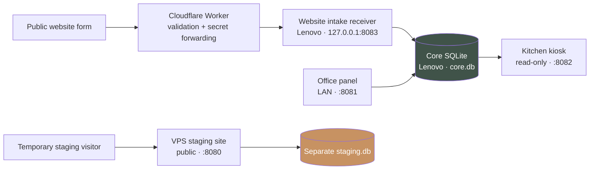
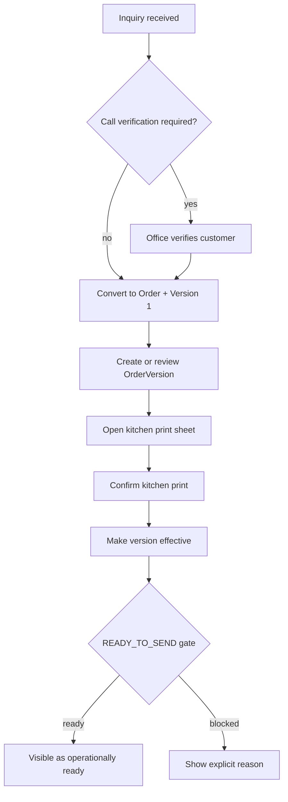

# Architecture

## System at a glance

The staging branch is intentionally disconnected from production. A test form
submission cannot become a production Inquiry.

## Layers

| Layer | Responsibility | Must not do |
|---|---|---|
| `domain/` | Records, value vocabularies, pure derived decisions | HTTP, persistence, external calls |
| `services/` | Business use cases and write gates | Render UI or parse public payloads |
| `repositories/` | In-memory and SQLite persistence, migrations | Invent business state |
| `intake/` | Channel-specific validation and mapping to Inquiry | Create orders directly |
| `integration/` | Optional external office integrations | Become operational truth |
| `ui/` | Office, kiosk, receiver, staging HTTP surfaces | Bypass services or repository invariants |
| `infra/` | systemd templates and Cloudflare Worker | Store secrets |

## Core records

### Inquiry

An Inquiry represents incoming demand. It records source, event date, CRM stage,
planning mode, verification state, and intake context. Public website inquiries
require verification by default.

### Order and OrderVersion

An Order is created from an eligible Inquiry. Each plan is an immutable
OrderVersion. Operational state is deliberately small:

- `candidate_order_version_id` — office-side progression hint;
- `effective_order_version_id` — selected operational version;
- `kitchen_print_confirmed_at` — print confirmation on a version;
- `cancelled_at` — explicit, irreversible cancellation fact.

`READY_TO_SEND` is derived, never stored. An order is ready only when it is not
cancelled, an effective version exists, and that version's kitchen print has
been confirmed.

## Main workflow

## Persistence and migrations

- Production uses one SQLite file shared by the three Lenovo services.
- Repositories apply ordered, component-specific migrations at startup.
- Migration history is stored in `schema_migrations`.
- Startup rejects unknown, incomplete, or name-mismatched migration history.
- Order/version ownership and unique version numbers are also protected by
  SQLite indexes and triggers.
- Take a verified backup before deploying code that may open the database.

## Trust boundaries

| Surface | Exposure | Authentication | Writes production? |
|---|---|---|---|
| Office panel | LAN/Tailscale only | HTTP Basic + CSRF on writes | Yes |
| Kitchen kiosk | LAN/Tailscale only | Trusted network boundary | No |
| Website receiver | loopback only | Bearer token from Worker | Inquiry only |
| Cloudflare Worker | public | Server-side upstream secret | Via receiver |
| VPS staging | public IP, HTTP | None; test data only | No |

See the [decision register](decisions/README.md) for the boundaries that must
survive future refactoring.
