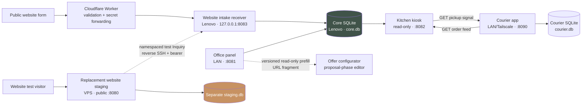
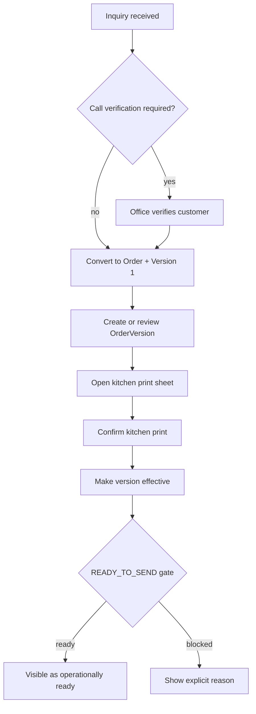

# Architecture

## System at a glance



The VPS remains a separate data environment. When the optional test bridge is
enabled, its backend may create a namespaced, fake-data Inquiry only through
the same narrow token-authenticated receiver used by the future website. It
never receives Core data, opens SQLite, or creates an Order. Disabling the
staging environment pair or the reverse SSH tunnel restores full isolation.

The test bridge is currently synchronous and fail-visible: Core acceptance
precedes the VPS audit write, and upstream failure returns `502`. ADR-010 keeps
that simple behavior for fake-data testing but requires a durable SQLite inbox
before any real customer traffic is allowed.

The courier app is also a separate bounded system with its own database. It
never reads or writes Core directly: it reads released order summaries from
the kiosk, while the kiosk reads outstanding equipment returns from the
courier app. Both cross-system routes are read-only.

The optional Inquiry-to-offer handoff copies known Core Inquiry values into the
separate configurator's editable in-memory draft. Its versioned envelope travels
in a URL fragment, which the configurator validates and immediately removes.
This creates no Order and gives no proposal data operational authority.

## Layers

| Layer | Responsibility | Must not do |
|---|---|---|
| `domain/` | Records, value vocabularies, pure derived decisions | HTTP, persistence, external calls |
| `services/` | Business use cases and write gates | Render UI or parse public payloads |
| `repositories/` | In-memory and SQLite persistence, migrations | Invent business state |
| `intake/` | Channel-specific validation and mapping to Inquiry | Create orders directly |
| `integration/` | Optional external office integrations | Become operational truth |
| `ui/` | Office, kiosk, receiver, staging HTTP surfaces | Bypass services or repository invariants |
| `infra/` | systemd templates and Cloudflare Worker | Store secrets |

## Core records

### Inquiry

An Inquiry represents incoming demand. It records source, event date, CRM stage,
planning mode, verification state, and intake context. Public website inquiries
require verification by default.

### Order and OrderVersion

An Order is created from an eligible Inquiry. Each plan is an immutable
OrderVersion. Operational state is deliberately small:

- `candidate_order_version_id` — office-side progression hint;
- `effective_order_version_id` — selected operational version;
- `kitchen_print_confirmed_at` — print confirmation on a version;
- `cancelled_at` — explicit, irreversible cancellation fact.

`READY_TO_SEND` is derived, never stored. An order is ready only when it is not
cancelled, an effective version exists, and that version's kitchen print has
been confirmed.

## Main workflow



## Persistence and migrations

- Core production uses one SQLite file shared by the office, kiosk, and intake
  services. The courier app has a separate SQLite file and migration history.
- Repositories apply ordered, component-specific migrations at startup.
- Migration history is stored in `schema_migrations`.
- Startup rejects unknown, incomplete, or name-mismatched migration history.
- Order/version ownership and unique version numbers are also protected by
  SQLite indexes and triggers.
- Take a verified backup before deploying code that may open the database.

## Configurator integration boundary

Configurator ↔ Core communication uses trusted handoff only.

The former manual JSON proposal export/import workflow
(`proposal_payload_v1` / `proposal-preview`) has been removed.

Core remains the source of truth for inquiries, offers, and orders.

## Configurator and Offer boundary

The Configurator owns the draft phase:
- browser editing state
- catalog selection
- price calculation
- temporary proposal preparation

The Core system does not store configurator drafts.

A commercial commitment starts only when a validated offer snapshot
is prepared through the trusted handoff flow.

Core owns:
- Offer
- OfferVersion
- immutable snapshot data
- commercial lifecycle evidence

Lifecycle:

Configurator draft
        |
        | trusted handoff
        v
OfferVersion (Prepared)
        |
        v
Sent
        |
        +--> Accepted
        |
        +--> Rejected

Accepted offers may be converted into Orders.

Order operational states (READY_TO_SEND, kitchen, courier)
are separate from commercial offer lifecycle.

## Offer sent evidence

Marking an offer as sent appends a SentEvidence record only.

The OfferVersion snapshot is immutable after preparation:
- positions are not rewritten;
- prices are not changed;
- snapshot_hash remains unchanged.

Prepared → Sent is a commercial lifecycle transition represented
by append-only evidence, not by modifying the OfferVersion itself.

The sent actor, channel, recipient reference and timestamp are stored
as evidence of the communication event.

## Offer acceptance and order conversion

Acceptance appends AcceptanceEvidence only.
The accepted OfferVersion remains immutable.

Conversion creates a new operational Order.
Accepted commercial facts are copied into an immutable
OrderCommercialSnapshot.

Operational consumers (confirmation, print, kitchen workflow)
must read OrderCommercialSnapshot and must not depend on
live Offer data.

Offer and Order remain linked through ConversionLink.

The originating Inquiry remains available through
Order.source_inquiry_id.

## Order operational release (READY_TO_SEND)

READY_TO_SEND is a derived operational state and is never stored.

An order is ready only when operational facts satisfy all release conditions:

- order is not cancelled;
- an effective OrderVersion exists;
- the effective version has confirmed kitchen print;
- no pending candidate version blocks execution;
- no operational pause blocks release.

`request_ready_to_send` evaluates current operational facts and emits the
corresponding event. It does not mutate the order into a stored ready state.

Kitchen Print uses OrderPrintProjection:

- OrderVersion provides operational event facts;
- OrderCommercialSnapshot provides frozen accepted commercial facts.

Operational consumers must not read live Offer data.

## Kitchen execution boundary

Kitchen execution starts only from READY_TO_SEND operational facts.

READY_TO_SEND is a derived release decision. It is not stored and it does not
create an order state transition.

The kitchen execution layer consumes an OrderPrintProjection generated from:

- OrderVersion operational facts;
- OrderCommercialSnapshot frozen at offer conversion.

Kitchen execution must not read live OfferVersion data.

Flow:

```text
Order facts
    |
    v
READY_TO_SEND evaluation
    |
    v
Kitchen Queue projection
    |
    v
Production execution facts
    |
    v
KitchenCompletionEvidence (append-only)
```

Kitchen completion is recorded as evidence. It does not mutate historical
commercial facts or rewrite OrderVersion snapshots.

## Delivery execution boundary

Delivery execution starts from kitchen completion facts.

`KitchenCompletionEvidence` is the handoff fact between kitchen execution
and delivery execution.

Delivery execution does not read OfferVersion or Configurator state.

`DeliveryQueueProjection` consumes frozen operational delivery data from
`OrderDeliverySnapshot` and does not use live Inquiry data.

The existing courier feed based on Wochenübersicht and effective
`OrderVersion` facts remains unchanged. Migration of courier visibility to
`DeliveryQueueProjection` is a future slice.

Flow:

```text
KitchenCompletionEvidence
    |
    v
Delivery Queue projection
    |
    v
Dispatch execution facts
    |
    v
DispatchEvidence (append-only)
    |
    v
DeliveryCompletionEvidence (append-only)
```

Dispatch and delivery completion are recorded as evidence. They do not mutate
`OrderVersion`, `OrderCommercialSnapshot`, or kitchen completion facts.

## Trust boundaries

| Surface | Exposure | Authentication | Writes production? |
|---|---|---|---|
| Office panel | LAN/Tailscale only | HTTP Basic + CSRF on writes | Yes |
| Kitchen kiosk | LAN/Tailscale only | Trusted network boundary | No |
| Courier app | LAN/Tailscale only | Basic auth, capability links, machine bearer | Courier DB only |
| Website receiver | loopback only | Bearer token from Worker | Inquiry only |
| Cloudflare Worker | public | Server-side upstream secret | Via receiver |
| VPS staging | public IP, HTTP | None; fake data only | Inquiry only through optional narrow bridge |
| VPS reverse tunnel `18083` | VPS loopback only | restricted SSH key + receiver bearer | Inquiry only |

See the [decision register](decisions/README.md) for the boundaries that must
survive future refactoring.
