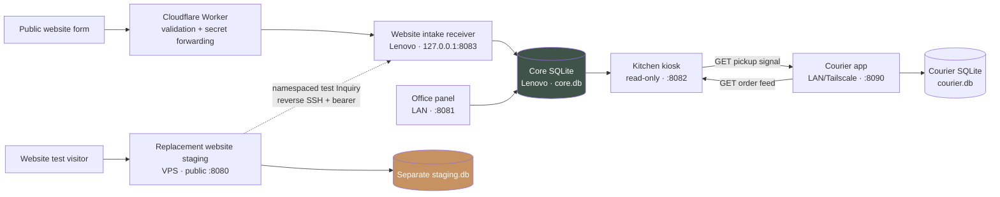
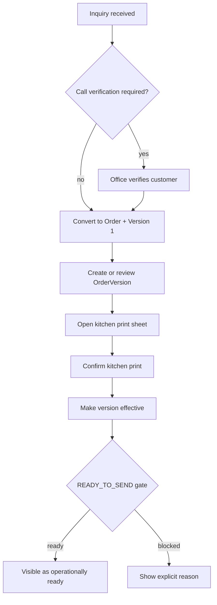

# Architecture

## System at a glance

The VPS remains a separate data environment. When the optional test bridge is
enabled, its backend may create a namespaced, fake-data Inquiry only through
the same narrow token-authenticated receiver used by the future website. It
never receives Core data, opens SQLite, or creates an Order. Disabling the
staging environment pair or the reverse SSH tunnel restores full isolation.

The test bridge is currently synchronous and fail-visible: Core acceptance
precedes the VPS audit write, and upstream failure returns `502`. ADR-010 keeps
that simple behavior for fake-data testing but requires a durable SQLite inbox
before any real customer traffic is allowed.

The courier app is also a separate bounded system with its own database. It
never reads or writes Core directly: it reads released order summaries from
the kiosk, while the kiosk reads outstanding equipment returns from the
courier app. Both cross-system routes are read-only.

## Layers

| Layer | Responsibility | Must not do |
|---|---|---|
| `domain/` | Records, value vocabularies, pure derived decisions | HTTP, persistence, external calls |
| `services/` | Business use cases and write gates | Render UI or parse public payloads |
| `repositories/` | In-memory and SQLite persistence, migrations | Invent business state |
| `intake/` | Channel-specific validation and mapping to Inquiry | Create orders directly |
| `integration/` | Optional external office integrations | Become operational truth |
| `ui/` | Office, kiosk, receiver, staging HTTP surfaces | Bypass services or repository invariants |
| `infra/` | systemd templates and Cloudflare Worker | Store secrets |

## Core records

### Inquiry

An Inquiry represents incoming demand. It records source, event date, CRM stage,
planning mode, verification state, and intake context. Public website inquiries
require verification by default.

### Order and OrderVersion

An Order is created from an eligible Inquiry. Each plan is an immutable
OrderVersion. Operational state is deliberately small:

- `candidate_order_version_id` — office-side progression hint;
- `effective_order_version_id` — selected operational version;
- `kitchen_print_confirmed_at` — print confirmation on a version;
- `cancelled_at` — explicit, irreversible cancellation fact.

`READY_TO_SEND` is derived, never stored. An order is ready only when it is not
cancelled, an effective version exists, and that version's kitchen print has
been confirmed.

## Main workflow

## Persistence and migrations

- Core production uses one SQLite file shared by the office, kiosk, and intake
  services. The courier app has a separate SQLite file and migration history.
- Repositories apply ordered, component-specific migrations at startup.
- Migration history is stored in `schema_migrations`.
- Startup rejects unknown, incomplete, or name-mismatched migration history.
- Order/version ownership and unique version numbers are also protected by
  SQLite indexes and triggers.
- Take a verified backup before deploying code that may open the database.

## Trust boundaries

| Surface | Exposure | Authentication | Writes production? |
|---|---|---|---|
| Office panel | LAN/Tailscale only | HTTP Basic + CSRF on writes | Yes |
| Kitchen kiosk | LAN/Tailscale only | Trusted network boundary | No |
| Courier app | LAN/Tailscale only | Basic auth, capability links, machine bearer | Courier DB only |
| Website receiver | loopback only | Bearer token from Worker | Inquiry only |
| Cloudflare Worker | public | Server-side upstream secret | Via receiver |
| VPS staging | public IP, HTTP | None; fake data only | Inquiry only through optional narrow bridge |
| VPS reverse tunnel `18083` | VPS loopback only | restricted SSH key + receiver bearer | Inquiry only |

See the [decision register](decisions/README.md) for the boundaries that must
survive future refactoring.
